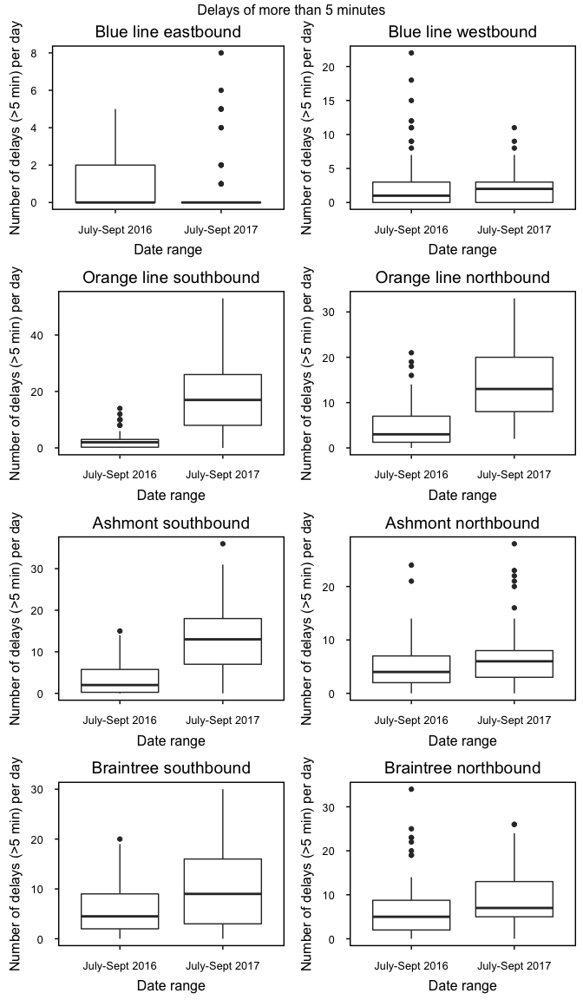
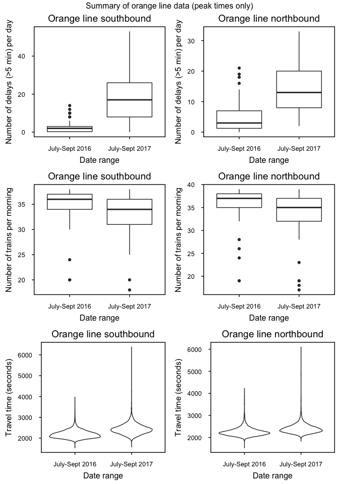

MBTA Calculations
================
Marshall Thomas
September 30, 2017

Summary
-------

-   For this analysis, I used data available from the MBTA API.
-   I compared July-September of 2016 to the same time in 2017.
-   I focused on rush hour traffic (6:00 AM - 10:00 AM; 4:00 PM - 8:00 PM).
-   I used the longest possible trip queries for each line. Practically, this meant querying from the first station to the second-to-last station, so these transit times are one station short of end-to-end.

### Delays by train line

-   Summer2016 covers July - September 2016
-   Summer2017 covers July - September 2017
-   Delays are for rush hours (6:00 - 10:00 AM and 4:00 - 8:00 PM).
-   Delays are relative to the MBTA "benchmark" time given for that trip.
-   **Conclusion: substantially increased delays since last summer on the orange line.**

<!-- -->

    ##                        Summer2016 Summer2017
    ## Orange line southbound   2.575758 17.3384615
    ## Orange line northbound   4.742424 14.1230769
    ## Blue line westbound      3.060606  2.2000000
    ## Blue line eastbound      1.060606  0.8307692
    ## Ashmont southbound       3.833333 12.8923077
    ## Braintree southbound     6.106061 10.2769231
    ## Ashmont northbound       4.878788  6.7230769
    ## Braintree northbound     7.045455  9.0307692

### Number of trains running by train line

-   Summer2016 covers July - September 2016
-   Summer2017 covers July - September 2017
-   Number of trains during morning rush hour only (6:00 - 10:00 AM).
-   **Conclusion: fewer morning trains running on the orange line since last summer (though not by much).**

<!-- -->

    ##                        Summer2016 Summer2017
    ## Orange line southbound   35.06061   32.83077
    ## Orange line northbound   35.65152   33.78462
    ## Blue line westbound      42.87879   45.47692
    ## Blue line eastbound      43.77273   47.09231
    ## Ashmont southbound       25.53846   25.58462
    ## Braintree southbound     23.56923   23.98438
    ## Ashmont northbound       26.06154   24.40000
    ## Braintree northbound     27.53846   25.60000

### Figure showing delays on each train line

### Orange line delays deep dive

-   The average number of delays per day this summer is **roughly equivalent to the number of delays on the worst day last summer**.
-   There are fewer trains running during the morning rush hour on the orange line.
-   There has been a significant increase in trip times on the orange line. 
