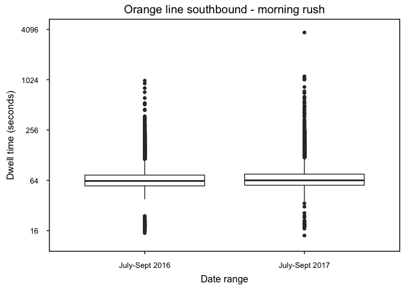
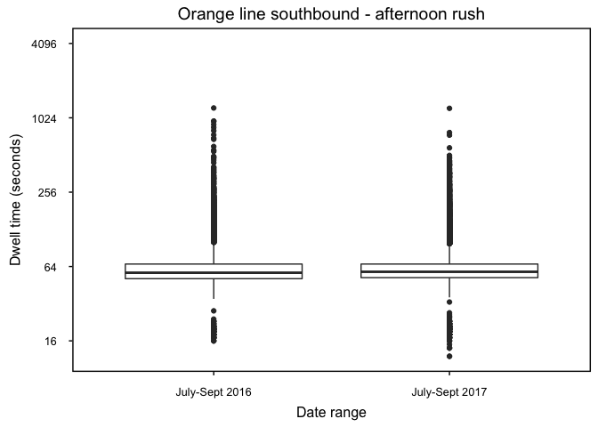

Orange Line Dwell Times
================
Marshall Thomas
9/30/2017

Summary
-------

Here, I analyzed the dwell times on the southbound branch of the orange line, from Malden Center to State Street. I hypothesized that the delays in 2017 could be due to overcrowding. If this were the case, we would have longer platform delays, because when there is a crowd on the platform it generally takes longer for the doors to close. I planned to compare crowding on the southbound inbound trains in the morning and afternoon, because delays in the inbound trains could be due to anything (mechanical failures, crowding, etc.), but crowding would be much worse in the morning, when most commuters are heading towards the city. Thus, if crowding were the cause of the slower service in 2017, we would expect to see longer dwell times in the morning inbound commute in 2017 relative to 2016. However, there is no major difference in dwell times.

### Morning dwell times - 2016 vs. 2017

-   This includes all stations from Malden Center to State Street
-   Oak Grove was excluded because the trains wait much longer there (however, including Oak Grove does not affect the conclusion of the analysis)
-   This is focused on the morning peak (6:00 - 10:00 AM)
-   This compares July-Sept 2016 with July-Sept 2017

### Afternoon dwell times - 2016 vs. 2017

-   This includes all stations from Malden Center to State Street
-   Oak Grove was excluded because the trains wait much longer there (however, including Oak Grove does not affect the conclusion of the analysis)
-   This is focused on the afternoon peak (4:00 - 8:00 PM)
-   This compares July-Sept 2016 with July-Sept 2017

<!-- -->

    ## Warning: Removed 7 rows containing non-finite values (stat_boxplot).

